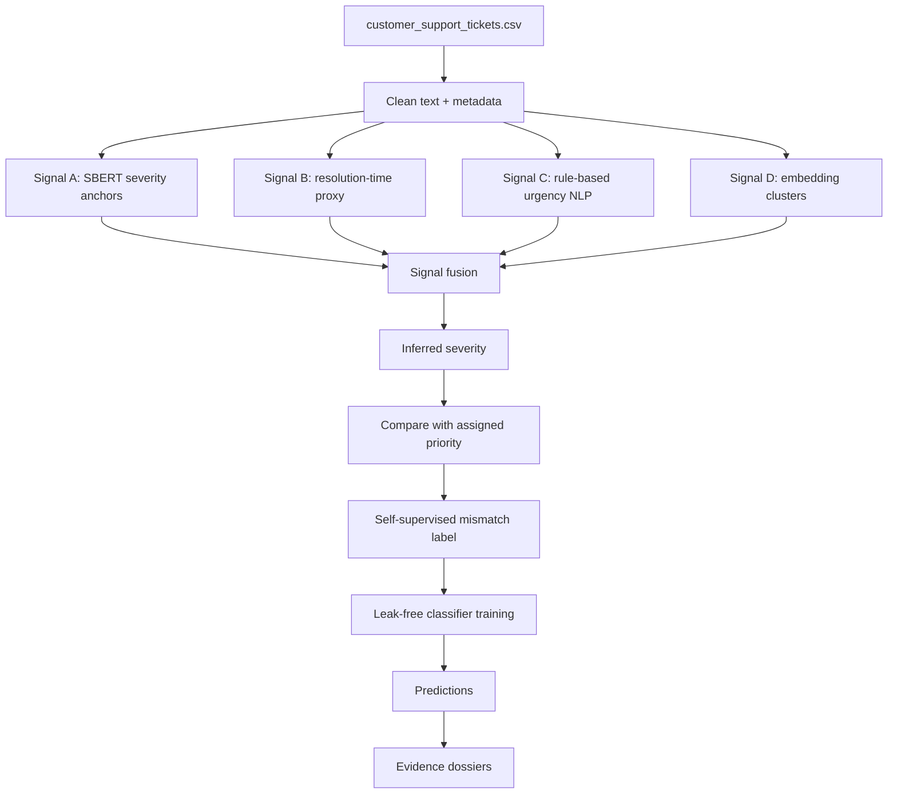

# Support Integrity Auditor (SIA)

SIA detects **Priority Mismatch** in customer support tickets. A mismatch happens when the objective ticket signals, such as text, channel, issue category, and resolution time, do not agree with the human-assigned priority.

The project is self-supervised: there is no original `mismatch_label` column. I first infer ticket severity independently from the assigned priority, then compare inferred severity with assigned priority to create pseudo-labels.

## Dataset

Expected input file:

```text
customer_support_tickets.csv
```

Required columns:

```text
Ticket_ID
Customer_Email
Ticket_Subject
Ticket_Description
Issue_Category
Priority_Level
Ticket_Channel
Resolution_Time_Hours
```

Optional columns like `Customer_Name`, `Assigned_Agent`, `Submission_Date`, and `Satisfaction_Score` are intentionally ignored during classifier training to reduce overfitting and post-resolution leakage.

## Architecture



## Methodology

### 1. Pseudo-Label Generation

The inferred severity is produced without using `Priority_Level`. Four independent signals are used:

- **Semantic anchor similarity:** compares ticket text to severity anchor examples using `all-MiniLM-L6-v2`.
- **Resolution-time proxy:** predicts resolution time from text and metadata, then maps longer expected resolution time to higher severity.
- **Rule-based NLP:** detects urgency, escalation, outage, security, and negation phrases.
- **Embedding clusters:** groups semantically similar tickets and assigns cluster severity.

The four signals are fused by searching for weights that maximize pairwise agreement while avoiding class collapse.

### 2. Classifier Training

The classifier is trained on the pseudo-labeled data. It uses only observable ticket fields:

- ticket subject and description
- assigned priority
- ticket channel
- issue category
- customer email domain
- resolution time and resolution bucket

The classifier does **not** receive direct pseudo-label answer columns.

Excluded leakage columns:

```text
inferred_severity_ordinal
severity_delta
fused_severity_score
sig_a_severity
sig_b_rt_proxy
sig_c_rules
sig_d_cluster
signal_agreement
mismatch_label
```

### 3. Imbalance and Overfitting Controls

The pipeline uses:

- stratified train/validation/test split
- validation-only threshold tuning
- XGBoost regularization (`max_depth=2`, `reg_alpha`, `reg_lambda`, `min_child_weight`)
- class imbalance handling with `scale_pos_weight`
- no fitting or threshold selection on the test split
- no use of `Assigned_Agent`, `Customer_Name`, `Satisfaction_Score`, or `Submission_Date`

## Running the Project

Install dependencies:

```bash
pip install -r requirements.txt
```

Train:

```bash
python train_pipeline.py --data customer_support_tickets.csv --model-dir models --outputs-dir outputs
```

Predict:

```bash
python predict.py --input customer_support_tickets.csv --model-dir models --output predictions.csv --dossiers dossiers.json
```

Run the Streamlit app locally:

```bash
streamlit run streamlit_app.py
```

## Streamlit Web App

The app is implemented in:

```text
streamlit_app.py
```

It supports:

- single-ticket form input
- batch CSV upload
- binary judgment for each ticket
- full Evidence Dossier for flagged mismatches
- Priority Mismatch Dashboard
- mismatch type distribution
- top contributing signal chart
- severity delta heatmap by issue category and channel

### Hosting

To get a hosted URL, deploy this repository on Streamlit Community Cloud:

1. Push these files to a public GitHub repository.
2. Go to [https://share.streamlit.io](https://share.streamlit.io).
3. Choose the repository.
4. Set the app entry file to:

```text
streamlit_app.py
```

5. Deploy the app.

The hosted app expects trained artifacts in the repository under:

```text
models/pseudo_label_artifacts.joblib
models/classifier_artifacts.joblib
```

If these files are not uploaded, train locally first:

```bash
python train_pipeline.py --data customer_support_tickets.csv --model-dir models --outputs-dir outputs
```

Then commit the `models/` directory if the artifact size is allowed by your hosting setup.

## Outputs

Training creates:

```text
models/pseudo_label_artifacts.joblib
models/classifier_artifacts.joblib
models/threshold_search.csv
outputs/metrics.json
outputs/train_pseudo_labeled.csv
outputs/val_pseudo_labeled.csv
outputs/test_pseudo_labeled.csv
```

Prediction creates:

```text
predictions.csv
dossiers.json
```

## Evidence Dossier Schema

Each flagged mismatch receives:

```json
{
  "ticket_id": "...",
  "assigned_priority": "...",
  "inferred_severity": "...",
  "mismatch_type": "Hidden Crisis | False Alarm",
  "severity_delta": "",
  "feature_evidence": [
    { "signal": "keyword", "value": "...", "weight": "..." },
    { "signal": "resolution_time", "value": "...", "interpretation": "..." }
  ],
  "constraint_analysis": "...",
  "confidence": ""
}
```

All dossier evidence is grounded in input fields or deterministic pipeline outputs.

## Ablation Table

Fill this table after running signal ablations in the notebook:

| Signals Used | Accuracy | Macro F1 | Recall Consistent | Recall Mismatch |
|---|---:|---:|---:|---:|
| SBERT only | TBD | TBD | TBD | TBD |
| Resolution proxy only | TBD | TBD | TBD | TBD |
| Rules only | TBD | TBD | TBD | TBD |
| Clusters only | TBD | TBD | TBD | TBD |
| All signals fused | See `outputs/metrics.json` | See `outputs/metrics.json` | See `outputs/metrics.json` | See `outputs/metrics.json` |

## Metric Results

After training, final metrics are written to:

```text
outputs/metrics.json
```

Report these values in the final submission:

- binary classification accuracy
- macro F1
- per-class recall
- pairwise pseudo-label signal agreement

## Deliverables

```text
notebook.ipynb
train_pipeline.py
predict.py
README.md
requirements.txt
streamlit_app.py
```
